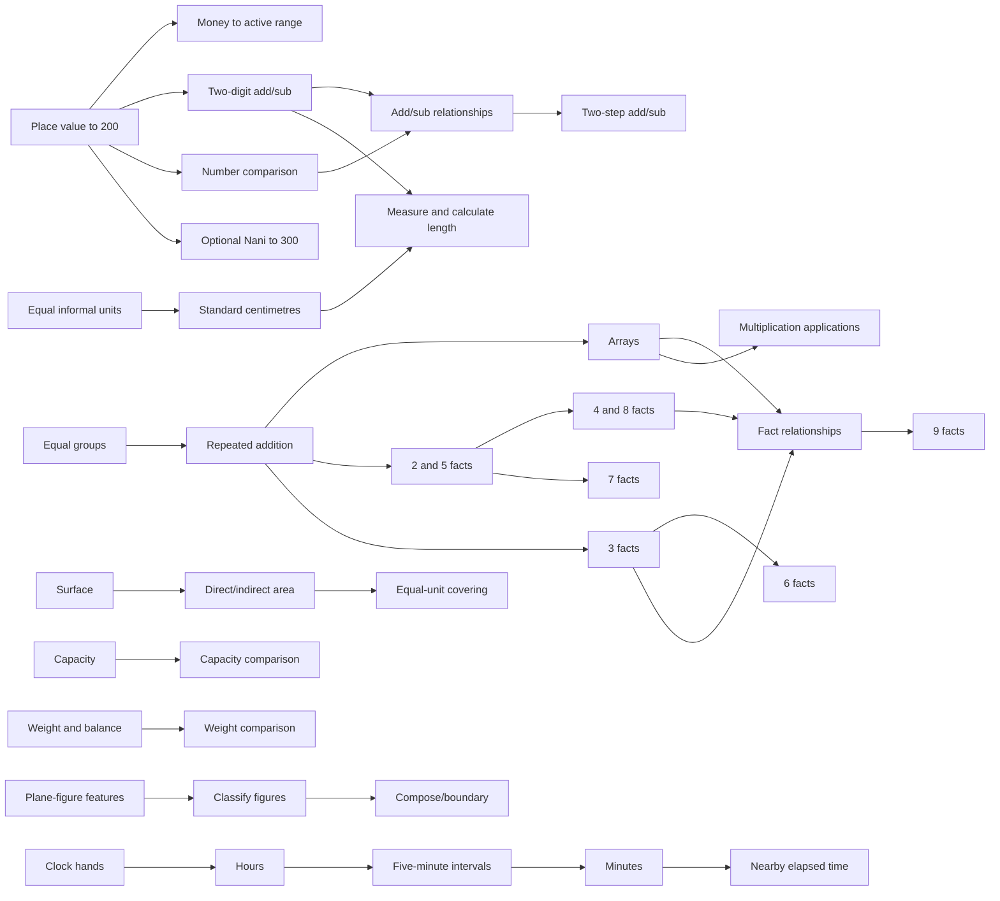

# Number Quest Grade 2A curriculum foundation

Status: **review draft — curriculum planning only**

Graph: `curriculum/grade-2a.skill-graph.json`

Runtime integration: **none**

Founder curriculum baseline: **Taiwan school year 115, first semester (`tw-115-1`)**. This fixes the target semester without pretending that all three accessible publisher sources expose the same edition identifier or level of detail.

This foundation prepares Number Quest to cover Taiwan elementary Grade 2 first-semester mathematics without turning publisher chapter order into the child's journey. It does not add a question bank, change the v1.0 runtime, or authorize implementation of a new World.

## Product boundary

- One common mastery graph owns prerequisites, learning evidence, retrieval, transfer and review.
- Kang Hsuan, Nani and Han Lin are alignment overlays only. They may say “surface this region soon,” but cannot create separate mastery states or bypass prerequisites.
- School progress is a weak surfacing signal. Observed mastery remains the path authority.
- Child-facing Worlds use missions, roles, discoveries and changing representations—not publisher names, unit numbers or textbook chapter titles.
- World membership is a surfacing taxonomy, not an assertion that every member skill is required for World completion. Only `core` skills may appear in `requiredForCompletionSkillIds`; `nani-extension` and `version-dependent` skills must appear only in `eligibilityBranchSkillIds`.
- No textbook questions, proprietary sequences or publisher wording are copied into gameplay.
- Wrong answers schedule support; they never remove earned capability or rewards.
- Multiplication is bounded to factors 1–9. This graph introduces fact families 2–9 and uses 1 only as a derivation identity when needed.
- Addition in the new Grade 2A calculation skills stays within 100. Subtraction and two-step paths require nonnegative intermediate and final quantities.
- Shared Grade 2A money work uses only 1, 5, 10, 50 and 100-dollar denominations within the active surfaced number range. It does not pull 500/1000-dollar Grade 2B work forward.

## What is machine-readable

The graph contains 60 skills and 78 prerequisite edges:

| Scope | Skills | Meaning |
|---|---:|---|
| `core` | 47 | Common Grade 2A foundation regardless of publisher order |
| `nani-extension` | 3 | Optional widening from 200 to 300; it never forks mastery |
| `version-dependent` | 10 | Capacity, weight, area comparison and plane-figure regions surfaced according to verified edition mapping |

Every skill has:

- a stable `g2a.*` ID, title, domain and scope;
- in-graph prerequisites plus explicit prior-grade prerequisites where needed;
- national curriculum-code references;
- misconception IDs;
- an answer-safe hint strategy;
- a nonpunitive retry strategy;
- a mastery-evidence profile;
- a spaced-review profile.

Catalog references are deliberate: shared misconceptions and strategies can be improved once without changing stable skill identity. The validator ensures every reference resolves.

## Common skill graph

The exact node and edge list lives in the JSON file. This compact view shows the intended dependency flow; parallel branches may be interleaved by the adaptive planner.

### Number and calculation paths

| Capability | Stable path |
|---|---|
| 200-range place value | `g2a.num.count-200` → `compose-200` → `represent-200` → `compare-200` |
| Optional Nani 300 range | `g2a.num.count-300-extension` → `compose-300-extension` → `compare-300-extension` |
| Money | `g2a.money.recognize-denominations` → `compose-count` → `exchange` → `use-exact-amount`; the same skills respect the active 200/300 surfaced range |
| Addition | `g2a.add.no-regroup-100` → `g2a.add.regroup-100` |
| Subtraction | `g2a.sub.no-regroup-100` → `g2a.sub.regroup-100` |
| Place-value explanation | both regrouping skills → `g2a.addsub.explain-vertical` |
| Relationships | `part-whole` → `change-unknown` / `compare-difference` → `inverse-check` |
| Two-step | `g2a.twostep.plan` → `add-add` / `sub-sub` → `mixed` |

### Measurement, multiplication and time paths

| Capability | Stable path |
|---|---|
| Length bridge and centimetres | `repeat-informal-units` → `cm-unit` → `measure-from-zero` → `measure-offset`; `estimate-cm` and `add-subtract-cm` branch after measurement |
| Multiplication meaning | `equal-groups` → `repeated-addition` → `arrays`; `times-language` branches from repeated addition |
| Fact families | 2/5 and 3 begin from meaning; 4 derives from 2; 8 from 4; 6 from 3+2; 7 from 5+2; 9 follows fact relationships |
| Fact strategy | arrays + established families → `facts-1-to-9-relations` |
| Time | `clock-hands` → `read-hour` → `read-five-minutes` → `read-minute` → `elapsed-clock-count` |

### Version-dependent comparison and geometry paths

| Region | Stable path |
|---|---|
| Capacity | `g2a.capacity.recognize` → `g2a.capacity.compare` |
| Weight | `g2a.weight.recognize-balance` → `g2a.weight.compare` |
| Area comparison | `g2a.area.recognize-surface` → `direct-indirect` → `informal-cover` |
| Plane figures | `g2a.shape.plane-features` → `classify-plane` → `compose-boundary` |

These regions remain in the same graph even when a publisher places them in another semester. A version overlay may defer surfacing; it may not fabricate mastery or duplicate skills.

## Coverage matrix

| Requested Grade 2A scope | Graph coverage | Scope status | Primary curriculum anchors |
|---|---:|---|---|
| 200-range place value and comparison | 4 skills | common core | `N-2-1`, `R-2-1` |
| Nani 300-range extension | 3 skills | optional extension | `N-2-1` |
| Money using 1/5/10/50/100-dollar denominations | 4 skills | common core within active surfaced range | `N-2-5` |
| Two-digit addition/subtraction, carrying/borrowing | 5 skills | common core | `N-2-2` |
| Equal informal units, centimetres and length | 6 skills | common core | `N-1-8`, `N-2-11` |
| Addition/subtraction relationships and applications | 5 skills | common core | `N-2-3`, `R-2-1`, `R-2-4` |
| Two-step addition/subtraction | 4 skills | common core | `N-2-8` |
| Multiplication concepts and 2–9 facts | 14 skills | common core | `N-2-6`, `N-2-7`, `R-2-3` |
| Telling time to hours/minutes | 5 skills | common core | `N-2-13` |
| Capacity | 2 skills | version-dependent | `N-2-12` |
| Weight | 2 skills | version-dependent | `N-2-12` |
| Area comparison | 3 skills | version-dependent | `N-2-12` |
| Plane figures | 3 skills | version-dependent | `S-2-1`, `S-2-2` |

“Common core” here means common to the bounded Number Quest Grade 2A foundation, not a claim that every publisher teaches the topic in the same week. National learning-content codes are grade-level anchors; publisher materials determine semester order.

## Learning metadata contract

### Misconceptions

Misconceptions describe an observable strategy, never a fixed child label. Examples include digit-wise place-value reasoning, counting money pieces instead of denomination values, treating an equal-value exchange as a value change, unexplained carrying/borrowing, keyword-only operation choice, stopping after one step, repeating unequal or gapped informal length units, counting ruler marks instead of intervals, unequal “equal groups,” swapping clock hands, judging capacity/weight by appearance, and using gapped units to compare area.

### Hint and retry

Hints follow this progression:

1. restore the mathematical object or relationship;
2. let the child act on a representation;
3. name one useful feature without exposing the answer;
4. return control for an independent choice.

Retries use a fresh isomorphic case, a concrete-to-symbolic step-back, a contrast case, or a bounded strategy choice. Repeating the identical item is not punishment, and a stronger hint is not counted as independent mastery.

### Mastery evidence

The graph defines five evidence profiles: concept, calculation, application, measurement and fact-family. Their review-gate machine rules and event contract live in `curriculum/grade-2a.mastery-rules.json`; the side-effect-free evaluator lives in `src/grade-2a-mastery.mjs`. All distinguish:

- acquisition across more than one instance;
- independent retrieval in later sessions;
- transfer across context or representation;
- recovery after a hint from independent success;
- scheduling effects from punitive loss of already earned capability.

Fact fluency is untimed. Fast tapping alone is never evidence of understanding.

### Spaced review

Review profiles expect:

- a same-session revisit after intervening activity;
- an early cross-session revisit around 1–3 days;
- a second retrieval window around 4–10 days;
- a later retention check around 14–30 days;
- representation or semantic variation before unnecessary magnitude growth.

These are expectation windows for a future planner, not a hard-coded promise that every child receives identical calendar intervals. Misses may pull review sooner; strong independent retrieval may widen the interval.

## Publisher alignment skeleton

Publisher mappings live under `publisherMappings` and reference only common skill IDs. They carry a verification status and confidence per group.

### Nani — target `tw-115-1`

The available 2026 Nani publisher outline aligns chronologically with the 115-1 baseline. Its exact approval/edition identifier remains to be recorded.

| Unit | Publisher topic | Graph region |
|---:|---|---|
| 1 | 數到300與錢幣應用 | common 200 skills + three 300-extension skills + four shared money skills |
| 2 | 二位數的加減 | two-digit calculation |
| 3 | 個別單位到幾公分 | equal informal units bridge to centimetres and length |
| 4 | 加減的關係與應用 | relationships/applications |
| 5 | 容量 | capacity |
| 6 | 兩步驟的加減 | two-step planning and calculation |
| 7 | 2、5、4、8 的乘法 | multiplication meaning + named fact families |
| 8 | 幾時幾分 | clock time |
| 9 | 3、6、7、9 的乘法 | remaining fact families + relationships |
| 10 | 平面圖形 | plane-figure features/classification/composition |

### Han Lin — target `tw-115-1`

The accessible detailed Han Lin Grade 2A teacher manual is edition 111. It supports the following structure and money placement, but the exact 115 edition identifier still needs primary confirmation.

| Unit | Publisher topic | Graph region |
|---:|---|---|
| 1 | 200以內的數與錢幣使用 | 200-range number skills + four shared money skills |
| 2 | 二位數的加減法 | two-digit calculation |
| 3 | 個別單位到認識公分 | equal informal units bridge to centimetres and length |
| 4 | 加減應用 | relationships/applications |
| 5 | 容量 | capacity |
| 6 | 加減兩步驟 | two-step planning and calculation |
| 7 | 乘法（一） | meaning + 2/5/4/8 facts |
| 8 | 時間 | clock time and nearby elapsed time |
| 9 | 乘法（二） | 3/6/7/9 facts + relationships |
| 10 | 面的大小比較 | direct, indirect and informal-unit area comparison |

### Kang Hsuan — target `tw-115-1`

The publisher's current curriculum-plan page and 115 low-grade mathematics bulletin are authoritative current evidence, but a Grade 2A unit-level list was not available as stable readable source material. The mapping includes the shared place-value-plus-money region and all other topic groups while deliberately leaving every `publisherUnit` as `null`. Capacity/weight/area/shape placement remains `unresolved-version-placement`.

This is a useful skeleton: a later verified unit list can fill order and placement without changing any skill ID, prerequisite or mastery record.

## Playable World / Quest families

| World | Child role | Mathematical region | Play premise |
|---|---|---|---|
| 百光港 | Signal keeper | place value/comparison | Build number signals for lost ships; Nani 300 is a wider harbor route, not another system |
| 交換橋工坊 | Bridge engineer | carrying/borrowing | Trade bundles to repair bridges and explain each exchange |
| 微光測量徑 | Trail mapper | informal units/centimetres/length | Repeat equal trail markers, discover standard centimetres, then measure and compare paths |
| 關係偵探社 | Relationship detective | add/sub applications | Find what changed or went missing without keyword guessing |
| 雙岔航線台 | Expedition planner | two-step add/sub | Discover the hidden intermediate quantity and plan a complete route |
| 倍數合唱林 | Pattern conductor | multiplication | Wake equal-group creatures and combine fact-family rhythms |
| 星刻觀測站 | Time navigator | hours/minutes | Set mechanisms for sky events and trace elapsed minutes |
| 萬象交換市集 | Evidence collector | money + eligible capacity/weight/area/shapes | Compose and exchange exact money amounts; add comparison mysteries only when their version branch is eligible |

Worlds are not required to unlock as eight textbook chapters. A future adaptive journey may pull a bounded quest from multiple unlocked families according to prerequisites, school-proximity and actual mastery.

### World membership versus completion

Every World declares three lists:

- `skillIds`: all skills the Quest family may surface;
- `requiredForCompletionSkillIds`: only common `core` skills that a future bounded World contract may consider for completion;
- `eligibilityBranchSkillIds`: `nani-extension` or `version-dependent` skills that may appear when alignment and readiness allow, but never become silent common requirements.

The two completion/branch lists must be disjoint and their union must equal `skillIds`. Automated validation enforces both the partition and the scope rule. For example:

- 百光港 requires only the four 200-range core skills; its three 300-range skills are eligibility branches.
- 萬象交換市集 contains four shared core money skills as potential completion skills, while all capacity, weight, area and shape skills remain eligibility branches.

This is curriculum metadata only. It does not add or change runtime World-completion behavior.

## Surfacing policy

Future planning should rank eligible skills using two separate signals:

1. **Readiness/mastery authority:** prerequisites, recent independent evidence, due retrieval, misconception repair and transfer needs.
2. **School-proximity preference:** verified publisher/edition position supplied locally by an adult, if available.

School proximity may break ties or reserve a bounded “coming soon at school” slot. It must never:

- mark a skill mastered;
- skip a prerequisite that the child has not demonstrated;
- suppress due retrieval indefinitely;
- expose publisher names or chapter numbers to the child;
- create publisher-specific progress records;
- turn a `nani-extension` or `version-dependent` World member into a common completion requirement.

## Explicit gaps and unresolved curriculum questions

1. **Kang Hsuan unit mapping:** exact current Grade 2A unit order and the placement of capacity, weight, area comparison and plane figures need an accessible primary unit list.
2. **Exact 115 edition identifiers:** the founder baseline is fixed to Taiwan school year 115 semester 1, but the accessible evidence differs: Nani has a 2026 outline, Han Lin's detailed manual is edition 111, and Kang Hsuan's 115 material does not expose a stable Grade 2A unit list.
3. **Area versus plane figures:** verified Nani and Han Lin sources place different terminal strands in Grade 2A. Exact Kang Hsuan placement remains unknown.
4. **Hands-on validity:** the national curriculum treats capacity, weight and area as operational activities. Screen-only success must not be labeled physical-world transfer; a future World needs an explicit physical/simulation evidence policy.
5. **Elapsed-time bound:** Han Lin explicitly mentions counting between two times. The graph currently limits this to nearby clock-time counting; a future contract must set a safe maximum interval before content generation.

Money scope is no longer unresolved: it is shared Grade 2A mastery using 1, 5, 10, 50 and 100-dollar denominations within the active range. None of the remaining gaps blocks review of the common graph; items 1–4 block claims of complete publisher-specific or physical-world implementation.

## Sources and provenance

- [National Academy for Educational Research — Mathematics Curriculum Manual, January 2025 update](https://www.naer.edu.tw/upload/1/9/doc/2021/%E6%95%B8%E5%AD%B8%E9%A0%98%E5%9F%9F%E8%AA%B2%E7%A8%8B%E6%89%8B%E5%86%8A%EF%BC%88114%E5%B9%B41%E6%9C%88%E6%9B%B4%E6%96%B0%E7%89%88%EF%BC%89.pdf)
- [Kang Hsuan — current curriculum-plan service](https://www.knsh.com.tw/service/plan)
- [Kang Hsuan — school year 115 low-grade mathematics bulletin](https://945cloud.knsh.com.tw/show/E/expo/pic/textbook_levels_low/115%281%29%E6%95%B8%E5%AD%B8%E7%89%B9%E5%88%8A.pdf)
- [Nani — 2026 elementary mathematics structure overview](https://naniexpo.nani.com.tw/uploads/pdf/20260312_201419_4ea29e252cdd.pdf)
- [Han Lin — Grade 2 semester 1 mathematics teacher manual, 111 edition](https://resource.hle.com.tw/Books/BooksResource/111%E5%9C%8B%E5%B0%8F%E6%95%B8%E5%AD%B82%E4%B8%8A%E6%95%99%E5%B8%AB%E6%89%8B%E5%86%8A-%E6%88%90%E6%9B%B8%28111f265000%29.pdf)

The graph paraphrases curriculum scope and publisher topics. It contains no copied textbook questions.

## Review gate before the first Grade 2A World

Do not implement a World until review accepts:

- stable IDs and prerequisite boundaries;
- mastery and spaced-review expectations;
- whether the optional 300 range is enabled only by Nani alignment or also by demonstrated readiness;
- the policy for version-dependent strands;
- the World membership/completion partition;
- the unresolved publisher edition questions above;
- which World is the smallest first playable slice.

The first World should then receive its own bounded product contract, question-generation invariants, semantic transfer plan, browser acceptance flows and protected exact-head review. This foundation does not pre-authorize that implementation.
