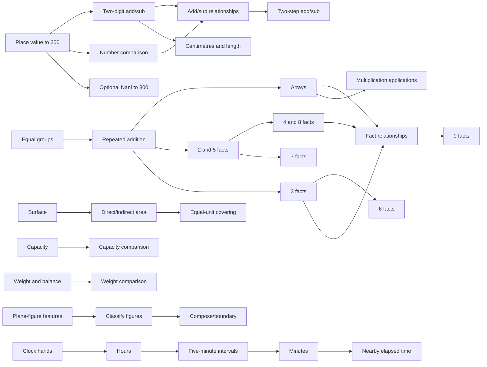

# Number Quest Grade 2A curriculum foundation

Status: **review draft — curriculum planning only**

Graph: `curriculum/grade-2a.skill-graph.json`

Runtime integration: **none**

This foundation prepares Number Quest to cover Taiwan elementary Grade 2 first-semester mathematics without turning publisher chapter order into the child's journey. It does not add a question bank, change the v1.0 runtime, or authorize implementation of a new World.

## Product boundary

- One common mastery graph owns prerequisites, learning evidence, retrieval, transfer and review.
- Kang Hsuan, Nani and Han Lin are alignment overlays only. They may say “surface this region soon,” but cannot create separate mastery states or bypass prerequisites.
- School progress is a weak surfacing signal. Observed mastery remains the path authority.
- Child-facing Worlds use missions, roles, discoveries and changing representations—not publisher names, unit numbers or textbook chapter titles.
- No textbook questions, proprietary sequences or publisher wording are copied into gameplay.
- Wrong answers schedule support; they never remove earned capability or rewards.
- Multiplication is bounded to factors 1–9. This graph introduces fact families 2–9 and uses 1 only as a derivation identity when needed.
- Addition in the new Grade 2A calculation skills stays within 100. Subtraction and two-step paths require nonnegative intermediate and final quantities.

## What is machine-readable

The graph contains 55 skills and 70 prerequisite edges:

| Scope | Skills | Meaning |
|---|---:|---|
| `core` | 42 | Common Grade 2A foundation regardless of publisher order |
| `nani-extension` | 3 | Optional widening from 200 to 300; it never forks mastery |
| `version-dependent` | 10 | Capacity, weight, area comparison and plane-figure regions surfaced according to verified edition mapping |

Every skill has:

- a stable `g2a.*` ID, title, domain and scope;
- in-graph prerequisites plus explicit prior-grade prerequisites where needed;
- national curriculum-code references;
- misconception IDs;
- an answer-safe hint strategy;
- a nonpunitive retry strategy;
- a mastery-evidence profile;
- a spaced-review profile.

Catalog references are deliberate: shared misconceptions and strategies can be improved once without changing stable skill identity. The validator ensures every reference resolves.

## Common skill graph

The exact node and edge list lives in the JSON file. This compact view shows the intended dependency flow; parallel branches may be interleaved by the adaptive planner.

### Number and calculation paths

| Capability | Stable path |
|---|---|
| 200-range place value | `g2a.num.count-200` → `compose-200` → `represent-200` → `compare-200` |
| Optional Nani 300 range | `g2a.num.count-300-extension` → `compose-300-extension` → `compare-300-extension` |
| Addition | `g2a.add.no-regroup-100` → `g2a.add.regroup-100` |
| Subtraction | `g2a.sub.no-regroup-100` → `g2a.sub.regroup-100` |
| Place-value explanation | both regrouping skills → `g2a.addsub.explain-vertical` |
| Relationships | `part-whole` → `change-unknown` / `compare-difference` → `inverse-check` |
| Two-step | `g2a.twostep.plan` → `add-add` / `sub-sub` → `mixed` |

### Measurement, multiplication and time paths

| Capability | Stable path |
|---|---|
| Centimetres | `cm-unit` → `measure-from-zero` → `measure-offset`; `estimate-cm` and `add-subtract-cm` branch after measurement |
| Multiplication meaning | `equal-groups` → `repeated-addition` → `arrays`; `times-language` branches from repeated addition |
| Fact families | 2/5 and 3 begin from meaning; 4 derives from 2; 8 from 4; 6 from 3+2; 7 from 5+2; 9 follows fact relationships |
| Fact strategy | arrays + established families → `facts-1-to-9-relations` |
| Time | `clock-hands` → `read-hour` → `read-five-minutes` → `read-minute` → `elapsed-clock-count` |

### Version-dependent comparison and geometry paths

| Region | Stable path |
|---|---|
| Capacity | `g2a.capacity.recognize` → `g2a.capacity.compare` |
| Weight | `g2a.weight.recognize-balance` → `g2a.weight.compare` |
| Area comparison | `g2a.area.recognize-surface` → `direct-indirect` → `informal-cover` |
| Plane figures | `g2a.shape.plane-features` → `classify-plane` → `compose-boundary` |

These regions remain in the same graph even when a publisher places them in another semester. A version overlay may defer surfacing; it may not fabricate mastery or duplicate skills.

## Coverage matrix

| Requested Grade 2A scope | Graph coverage | Scope status | Primary curriculum anchors |
|---|---:|---|---|
| 200-range place value and comparison | 4 skills | common core | `N-2-1`, `R-2-1` |
| Nani 300-range extension | 3 skills | optional extension | `N-2-1` |
| Two-digit addition/subtraction, carrying/borrowing | 5 skills | common core | `N-2-2` |
| Centimetres and length | 5 skills | common core | `N-2-11` |
| Addition/subtraction relationships and applications | 5 skills | common core | `N-2-3`, `R-2-1`, `R-2-4` |
| Two-step addition/subtraction | 4 skills | common core | `N-2-8` |
| Multiplication concepts and 2–9 facts | 14 skills | common core | `N-2-6`, `N-2-7`, `R-2-3` |
| Telling time to hours/minutes | 5 skills | common core | `N-2-13` |
| Capacity | 2 skills | version-dependent | `N-2-12` |
| Weight | 2 skills | version-dependent | `N-2-12` |
| Area comparison | 3 skills | version-dependent | `N-2-12` |
| Plane figures | 3 skills | version-dependent | `S-2-1`, `S-2-2` |

“Common core” here means common to the bounded Number Quest Grade 2A foundation, not a claim that every publisher teaches the topic in the same week. National learning-content codes are grade-level anchors; publisher materials determine semester order.

## Learning metadata contract

### Misconceptions

Misconceptions describe an observable strategy, never a fixed child label. Examples include digit-wise place-value reasoning, unexplained carrying/borrowing, keyword-only operation choice, stopping after one step, counting ruler marks instead of intervals, unequal “equal groups,” swapping clock hands, judging capacity/weight by appearance, and using gapped units to compare area.

### Hint and retry

Hints follow this progression:

1. restore the mathematical object or relationship;
2. let the child act on a representation;
3. name one useful feature without exposing the answer;
4. return control for an independent choice.

Retries use a fresh isomorphic case, a concrete-to-symbolic step-back, a contrast case, or a bounded strategy choice. Repeating the identical item is not punishment, and a stronger hint is not counted as independent mastery.

### Mastery evidence

The graph defines four evidence profiles: concept, calculation, application, measurement and fact-family. All distinguish:

- acquisition across more than one instance;
- independent retrieval in later sessions;
- transfer across context or representation;
- recovery after a hint from independent success;
- scheduling effects from punitive loss of already earned capability.

Fact fluency is untimed. Fast tapping alone is never evidence of understanding.

### Spaced review

Review profiles expect:

- a same-session revisit after intervening activity;
- an early cross-session revisit around 1–3 days;
- a second retrieval window around 4–10 days;
- a later retention check around 14–30 days;
- representation or semantic variation before unnecessary magnitude growth.

These are expectation windows for a future planner, not a hard-coded promise that every child receives identical calendar intervals. Misses may pull review sooner; strong independent retrieval may widen the interval.

## Publisher alignment skeleton

Publisher mappings live under `publisherMappings` and reference only common skill IDs. They carry a verification status and confidence per group.

### Nani

The available Nani publisher outline supports this sequence:

| Unit | Publisher topic | Graph region |
|---:|---|---|
| 1 | 數到300 | common 200 skills + three 300-extension skills |
| 2 | 二位數的加減 | two-digit calculation |
| 3 | 幾公分 | centimetres and length |
| 4 | 加減的關係與應用 | relationships/applications |
| 5 | 容量 | capacity |
| 6 | 兩步驟的加減 | two-step planning and calculation |
| 7 | 2、5、4、8 的乘法 | multiplication meaning + named fact families |
| 8 | 幾時幾分 | clock time |
| 9 | 3、6、7、9 的乘法 | remaining fact families + relationships |
| 10 | 平面圖形 | plane-figure features/classification/composition |

### Han Lin

The accessible Han Lin Grade 2A teacher manual supports this sequence:

| Unit | Publisher topic | Graph region |
|---:|---|---|
| 1 | 200以內的數 | 200-range number skills |
| 2 | 二位數的加減法 | two-digit calculation |
| 3 | 認識公分 | centimetres and length |
| 4 | 加減應用 | relationships/applications |
| 5 | 容量 | capacity |
| 6 | 加減兩步驟 | two-step planning and calculation |
| 7 | 乘法（一） | meaning + 2/5/4/8 facts |
| 8 | 時間 | clock time and nearby elapsed time |
| 9 | 乘法（二） | 3/6/7/9 facts + relationships |
| 10 | 面的大小比較 | direct, indirect and informal-unit area comparison |

### Kang Hsuan

The publisher's current curriculum-plan landing page is authoritative, but its unit-level download was not available as stable readable source material during this task. The mapping therefore includes all common topic groups but deliberately leaves every `publisherUnit` as `null` with `topic-scope-only` confidence. Capacity/weight/area/shape placement is marked `unresolved-version-placement`.

This is a useful skeleton: a later verified unit list can fill order and placement without changing any skill ID, prerequisite or mastery record.

## Playable World / Quest families

| World | Child role | Mathematical region | Play premise |
|---|---|---|---|
| 百光港 | Signal keeper | place value/comparison | Build number signals for lost ships; Nani 300 is a wider harbor route, not another system |
| 交換橋工坊 | Bridge engineer | carrying/borrowing | Trade bundles to repair bridges and explain each exchange |
| 微光測量徑 | Trail mapper | centimetres/length | Measure, draw and compare paths for traveling creatures |
| 關係偵探社 | Relationship detective | add/sub applications | Find what changed or went missing without keyword guessing |
| 雙岔航線台 | Expedition planner | two-step add/sub | Discover the hidden intermediate quantity and plan a complete route |
| 倍數合唱林 | Pattern conductor | multiplication | Wake equal-group creatures and combine fact-family rhythms |
| 星刻觀測站 | Time navigator | hours/minutes | Set mechanisms for sky events and trace elapsed minutes |
| 萬象交換市集 | Evidence collector | capacity/weight/area/shapes | Solve pouring, balancing, covering and shape mysteries using observable evidence |

Worlds are not required to unlock as eight textbook chapters. A future adaptive journey may pull a bounded quest from multiple unlocked families according to prerequisites, school-proximity and actual mastery.

## Surfacing policy

Future planning should rank eligible skills using two separate signals:

1. **Readiness/mastery authority:** prerequisites, recent independent evidence, due retrieval, misconception repair and transfer needs.
2. **School-proximity preference:** verified publisher/edition position supplied locally by an adult, if available.

School proximity may break ties or reserve a bounded “coming soon at school” slot. It must never:

- mark a skill mastered;
- skip a prerequisite that the child has not demonstrated;
- suppress due retrieval indefinitely;
- expose publisher names or chapter numbers to the child;
- create publisher-specific progress records.

## Explicit gaps and unresolved curriculum questions

1. **Kang Hsuan unit mapping:** exact current Grade 2A unit order and the placement of capacity, weight, area comparison and plane figures need an accessible primary unit list.
2. **Edition freeze:** Nani evidence is current 2026 publisher material; the accessible Han Lin manual is the 111 edition. Founder dogfood must choose a school year/edition before claiming release-specific sync.
3. **Han Lin money objective:** its manual includes coin conversion/payment in the 200-range unit. This was outside the supplied bounded scope and is not silently added to the graph.
4. **Area versus plane figures:** verified Nani and Han Lin sources place different terminal strands in Grade 2A. Exact Kang Hsuan placement remains unknown.
5. **Hands-on validity:** the national curriculum treats capacity, weight and area as operational activities. Screen-only success must not be labeled physical-world transfer; a future World needs an explicit physical/simulation evidence policy.
6. **Elapsed-time bound:** Han Lin explicitly mentions counting between two times. The graph currently limits this to nearby clock-time counting; a future contract must set a safe maximum interval before content generation.

None of these gaps blocks review of the common graph. Items 1, 2, 4 and 5 block claims of complete publisher-specific implementation.

## Sources and provenance

- [National Academy for Educational Research — Mathematics Curriculum Manual, January 2025 update](https://www.naer.edu.tw/upload/1/9/doc/2021/%E6%95%B8%E5%AD%B8%E9%A0%98%E5%9F%9F%E8%AA%B2%E7%A8%8B%E6%89%8B%E5%86%8A%EF%BC%88114%E5%B9%B41%E6%9C%88%E6%9B%B4%E6%96%B0%E7%89%88%EF%BC%89.pdf)
- [Kang Hsuan — current curriculum-plan service](https://www.knsh.com.tw/service/plan)
- [Nani — 2026 elementary mathematics structure overview](https://naniexpo.nani.com.tw/uploads/pdf/20260312_201419_4ea29e252cdd.pdf)
- [Han Lin — Grade 2 semester 1 mathematics teacher manual, 111 edition](https://resource.hle.com.tw/Books/BooksResource/111%E5%9C%8B%E5%B0%8F%E6%95%B8%E5%AD%B82%E4%B8%8A%E6%95%99%E5%B8%AB%E6%89%8B%E5%86%8A-%E6%88%90%E6%9B%B8%28111f265000%29.pdf)

The graph paraphrases curriculum scope and publisher topics. It contains no copied textbook questions.

## Review gate before the first Grade 2A World

Do not implement a World until review accepts:

- stable IDs and prerequisite boundaries;
- mastery and spaced-review expectations;
- whether the optional 300 range is enabled only by Nani alignment or also by demonstrated readiness;
- the policy for version-dependent strands;
- the unresolved publisher edition questions above;
- which World is the smallest first playable slice.

The first World should then receive its own bounded product contract, question-generation invariants, semantic transfer plan, browser acceptance flows and protected exact-head review. This foundation does not pre-authorize that implementation.
